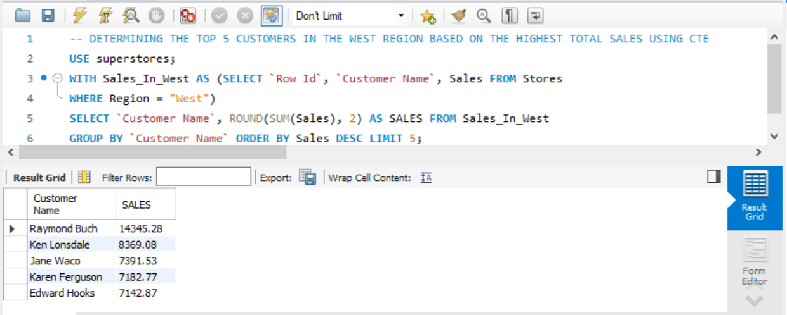
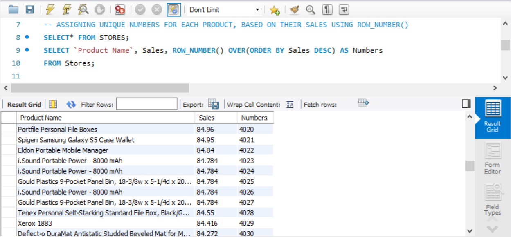
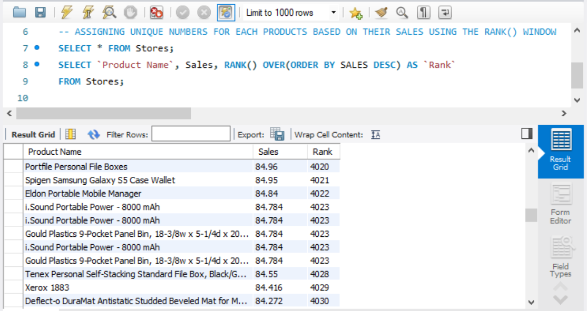
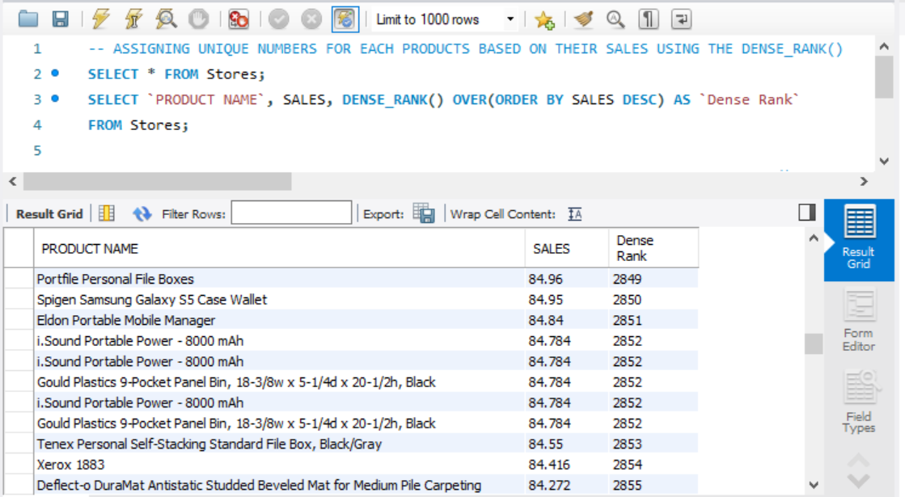

# SALES RANKING AND ANALYSIS

## INTRODUCTION
In this analytical endeavor, we will embark on a comprehensive exploration of sales data within the West region, aiming to unveil key insights into customer performance and product sales rankings. The primary objective is to identify and determine the top 5 customers in the West region, leveraging the powerful capabilities of window functions. Specifically, we employ the row_number() window function to establish a ranking of customers based on their total sales. Simultaneously, we utilize the rank() and dense_rank() window functions to assign unique numerical identifiers to individual products, emphasizing their sales performance. This task not only facilitates the identification of top-performing customers but also delves into a granular analysis of product sales, enriching our understanding of market dynamics within the West region.

## PROBLEM STATEMENT

This task entails formulating a comprehensive inquiry and generating a report that explains the top 5 customers in the West region, accompanied by distinctive rankings for each product determined by their sales. The specific questions addressed in this endeavor include:
1. Identify the top 5 customers in the West region based on the highest total sales
2. Utilize window functions for efficient analysis and ranking
   - Implement the row_number() window function to rank each product based on their sales.
   - Employ the rank() window function to assign unique numbers to each product based on their sales.
   - Utilize the dense_rank() window function to rank each product based on their sales.

## SKILLS AND CONCEPTS TO BE DEMOSTRATED
1. Data Analysis:
   - Ability to analyze and interprete sales data to identify top-performing customers
2. Region-Specific Analysis:
   - Focusing on data within the West region, showcasing the ability to narrow analysis to specific regions
3. SQL Window Functions
   
4. Reporting and Communication.

By completing this task, a combination of technical SQL skills, analytical thinking, and effective communication in presenting the outcomes of the analysis is demonstrated.

## ANALYSIS, DISCUSSSIONS AND RESULTS

### 1.  Identify the top 5 customers in the West region based on the highest total sales:

To pinpoint the top 5 customers in the West region, determined by their highest total sales, we leverage the COMMON TABLE EXPRESSION (CTE) feature, the SELECT function, the GROUP BY clause, and the ORDER BY function. The SQL syntax for this operation is detailed below:

```sql
WITH SALES_IN_WEST AS
    (SELECT `Row ID`, `Customer Name`, Sales FROM Stores
    WHERE Region = "West")
SELECT `Customer Name`, ROUND(SUM(Sales), 2) AS SALES FROM SALES_IN_WEST
GROUP BY `Customer Name`
ORDER BY SALES DESC 
LIMIT 5;
```

Explanation:
- Common Table Expression (CTE): The CTE named "SALES_IN_WEST" filters the data from the "Stores" table, specifically extracting the Row ID, Customer Name, and Sales columns for records located in the West region.
- SELECT Clause: The main query then selects the Customer Name and calculates the rounded sum of sales for each customer in the West region using the ROUND() function.
- GROUP BY Clause: The results are grouped by Customer Name to consolidate sales data for each customer.
- ORDER BY Clause: The results are then ordered in descending order based on total sales (SALES), ensuring the customer with the highest total sales appears first.
- LIMIT Clause: Finally, the LIMIT 5 restricts the output to only the top 5 customers with the highest total sales in the West region.

The outcome of this SQL query reveals that Raymond Buch holds the highest total sales in the West region, amounting to $14,345.28.




### 2.  Utilize window functions for efficient analysis and ranking: 

---
  -  A.   Implement the row_number() window function to rank each product based on their sales:
  ---
  To utilize the row_number() window function for ranking each product based on their sales, we employ the SELECT function, the ROW_NUMBER function, the ORDER BY clause, and the AS keyword for aliasing. The SQL syntax is as follows:

```sql
SELECT `Product Name`, Sales, ROW_NUMBER() OVER (ORDER BY Sales DESC) AS Numbers
FROM Stores;
```
Explanation:
- SELECT Clause: This part of the query specifies the columns to be included in the output, which, in this case, are Product Name, Sales, and the result of the row_number() window function.
- ROW_NUMBER() OVER Clause: The ROW_NUMBER() function is a window function that assigns a unique number to each row based on the specified ordering. In this case, it orders the rows by the Sales column in descending order (ORDER BY Sales DESC).
- AS Clause: The AS keyword is used to alias the result of the ROW_NUMBER() function as Numbers. This alias can be referenced in the output.

The outcome of this SQL query is a list of products with their respective sales and unique numbers assigned by the row_number() function. It's important to note that even if there are products with the same sales values, the row_number() function will assign distinct numbers to each row, ensuring uniqueness in the ranking.

---


   - B.   Employ the rank() window function to assign unique numbers to each product based on their sales:
---
To apply the rank() window function for ranking each product based on their sales, we utilize the SELECT function, the RANK function, the ORDER BY clause, and the AS keyword for aliasing. The SQL syntax is presented below:

```sql
SELECT `Product Name`, Sales, RANK() OVER (ORDER BY Sales DESC) AS `Rank`
FROM Stores;
```
Explanation:

- SELECT Clause: Specifies the columns to be included in the output - Product Name, Sales, and the result of the rank() window function.
- RANK() OVER Clause: The RANK() function is a window function that assigns a unique rank to each row based on the specified ordering. In this case, it orders the rows by the Sales column in descending order (ORDER BY Sales DESC).
- AS Clause: The AS keyword is used to alias the result of the RANK() function as Rank. This alias can be referenced in the output.

The outcome of this SQL query is a list of products with their respective sales and the unique rank assigned by the rank() function. It's important to note that if multiple rows have the same sales values, they will share the same rank, and the next rank will be skipped. For instance, if five rows have the same rank of 4023, the sixth row will have a rank of 4028, bypassing ranks 4024, 4025, 4026, and 4027.

---
   - C.   Utilize the dense_rank() window function to rank each product based on their sales:
---

To employ the DENSE_RANK() window function for ranking each product based on their sales, we utilize the SELECT function, the DENSE_RANK function, the ORDER BY clause, and the AS keyword for aliasing. The SQL syntax is presented below:

```SQL
SELECT `Product Name`, Sales, DENSE_RANK() OVER (ORDER BY Sales DESC) AS `Dense_Rank` 
FROM Stores;
```
Explanation:
- SELECT Clause: Specifies the columns to be included in the output - Product Name, Sales, and the result of the DENSE_RANK() window function.
- DENSE_RANK() OVER Clause: The DENSE_RANK() function is a window function that assigns a unique rank to each row based on the specified ordering. In this case, it orders the rows by the Sales column in descending order (ORDER BY Sales DESC).
- AS Clause: The AS keyword is used to alias the result of the DENSE_RANK() function as Dense_Rank. This alias can be referenced in the output.

The outcome of this SQL query is a list of products with their respective sales and the unique rank assigned by the DENSE_RANK() function. It's noteworthy that if multiple rows have the same sales values, they will be assigned the same rank, and the next rank will not be skipped. For instance, if five rows have the same rank of 2852, the sixth row will be assigned the rank of 2853, in contrast to the behavior of the RANK() function.

ROW_NUMBER        | RANK             | DENSE_RANK
:-----------------:|:----------------:|:------------------:
    |   | 

## CONCLUSION

In conclusion, these analyses contribute to a more nuanced understanding of the West region's market dynamics, highlighting both top-performing customers and the sales performance of individual products. The presented SQL queries showcase a proficiency in using window functions for insightful data manipulation and ranking, emphasizing the importance of such techniques in data analysis and decision support.


